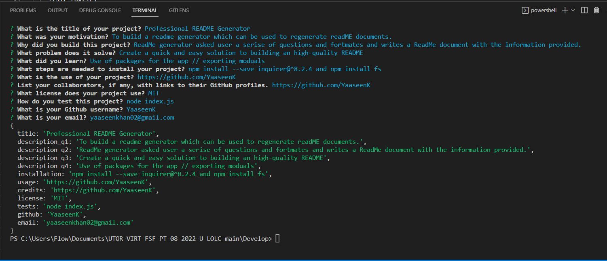

  # Professional README Generator

  ## License:
   MIT   "

  ## Description 
   * Motivation:
    To build a readme generator which can be used to regenerate readME documents.
   * Build information:
    ReadMe generator asked user a serise of questions and fortmates and writes a ReadMe document with the information provided.
   * Problem and solutions:
    Create a quick and easy solution to building an high-quality README
   * Knowledge:
    Use of packages for the app // exporting moduals

  ## Table of Contents:
   * [Description](#description)
   * [License](#license)
   * [Installation](#installation)
   * [Usage](#usage)
   * [Credits](#Credits)
   * [Tests](#tests)
   * [Questions](#questions)

  ## Installation:
   You must install the following for this app to function:
   npm install --save inquirer@^8.2.4 and npm install fs

  ## Usage:
  	
   README generator

  ## Credits:
   https://github.com/YaaseenK

  ## Tests:
   Run the following commands in your terminal to test this app:
   node index.js

  ## Contact Info:
   #Github: https://github.com/YaaseenK
   #Email: yaaseenkhan02@gmail.com
